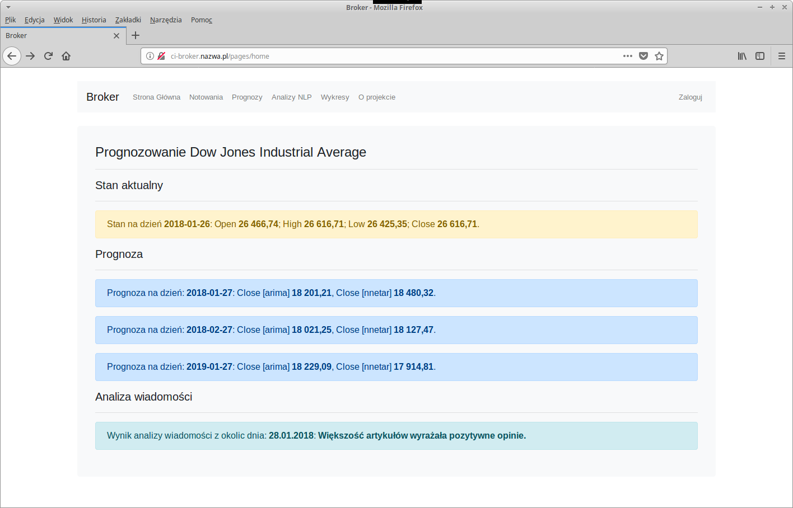

= Inteligencja Obliczeniowa
Projekt "Broker" – Kamil Pek
Trójmiasto, v0.1, 2018-01
:doctype: book
:reproducible:
//:source-highlighter: coderay
:source-highlighter: rouge
:listing-caption: Listing
// Generowanie PDF: asciidoctor-pdf sprawozdanie.adoc

== Prognozowanie indeksu Dow Jones Industrial.

=== Wygląd początkowy - stan przed refaktoryzacją

=== Autor:

* https://github.com/kamilpek[Kamil Pek]
* https://github.com/kamilpek/broker[Repozytorium GitHub]
* http://ci-broker.nazwa.pl/pages/home[Wersja Produkcyjna]

== O projekcie

Prognozowanie indeksu Dow Jones Industrial z użyciem modelu ARIMA, sieci neuronowych oraz przetwarzania języka naturalnego.

Idea projektu przewiduje stowrzenie serwisu wspomagającego podejmowanie decyzji podczas inwestowania na giełdzie. Przedmiotem projektu stał się indeks akcji Dow Jones Industrial Average, jest to jeden z najważniejszych indeksów akcji spółek notowanych na Giełdzie Papierów Wartościowych w Nowym Jorku (New York Stock Exchange) i NASDAQ. Indeks ten został stworzony przez Charlesa Dowa i statystyka Edwarda Jonesa. Indeks Dow Jones jest najstarszym działającym indeksem akcji w Stanach Zjednoczonych. Obecnie składa się on z 30 największych amerykańskich przedsiębiorstw wikipedia. Rekordy indeksu pobierane są z portalu stooq.com w postaci pliku csv, następnie trafiają do bazy danych PostgreSQL, ta operacja wykonywana jest przez skrypt w języku Ruby. W celu prognozy z użyciem modelu ARIMA i sieci neuronowych użyto takie paczki jak "forecast", "tseries" i "lubridate" oraz środowiska R, każdorazowa prognoza trafia do bazy danych i jej wyniki prezentowane są na stronie web. Dodatkowo przeprowadzana jest analiza najnowszych wiadomości dotyczących wspomaniego indeksu giełdowego. Wiadomości pobierane są ze stron www.marketwatch.com oraz www.cnbc.com następnie za pomocą paczek "rvest", "dplyr", "stringr", "tm", "SentimentAnalysis" i środowiska R przeprowadzana jest analiza artykułów pod kątem nastrojów wyrażanych w treści. Analiza zapisywana jest w bazie. Warstwa prezentacji pobieranych i opracowywanych danych wykonan została za pomocą frameworku Ruby On Rails.
